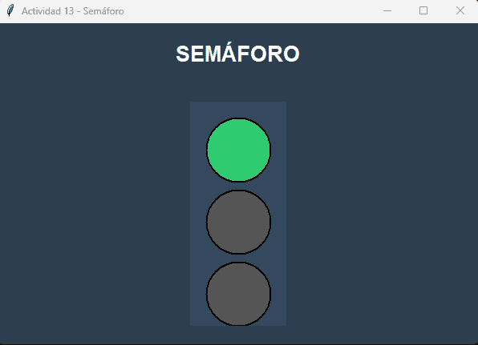
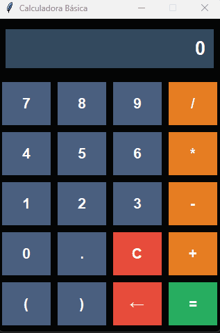

[](README.es.md)

# 📚 Tkinter Practices - GUI with Python


This repository contains a collection of **14 educational exercises** developed with **Tkinter**, Python's standard library for creating graphical user interfaces (GUI).

---

## 🎬 Preview

<div align="center">

### 🚦 Automatic Traffic Light - Practice 13


### 🧮 Full Calculator - Practice 14


</div>

---

## 📋 Project Contents

This project is a series of progressive exercises ranging from basic concepts to more complex Tkinter applications:

### 🔹 Basic Practices (1-5)
- **Practice 1:** Basic 1000x500 window
- **Practice 2:** Window with custom title and background color
- **Practice 3:** Label with custom styles (font, colors, padding)
- **Practice 4:** Button that prints messages to the terminal
- **Practice 5:** Button that changes a label's text

### 🔹 Data Input and Forms (6-7)
- **Practice 6:** Text field with button to display the entered name
- **Practice 7:** Interactive questionnaire with multiple input fields

### 🔹 Layout with Frames (8-9)
- **Practice 8:** 4-frame grid (2x2) with different colors
- **Practice 9:** Nested frames with an inner button

### 🔹 Advanced Interactivity (10-11)
- **Practice 10:** Move a label horizontally with buttons
- **Practice 11:** Selection list (Listbox) with display of selected item

### 🔹 Complete Applications (12-14)
- **Practice 12:** Simple addition calculator with error validation
- **Practice 13:** Traffic light simulator with automatic switching and timer
- **Practice 14:** Full basic calculator with arithmetic operations, keyboard support and validation

---

## 🎯 Learning Objectives

These practices cover the following core Tkinter concepts:

- ✅ Creating and configuring windows (`Tk()`)
- ✅ Basic widgets: `Label`, `Button`, `Entry`, `Listbox`, `Canvas`
- ✅ Geometry managers: `pack()`, `grid()`, `place()`
- ✅ Event handling with `command` and `bind()`
- ✅ Layout organization with `Frame` and nested frames
- ✅ Input data validation
- ✅ Using timers with `after()`
- ✅ Pop-up messages with `messagebox`
- ✅ Advanced customization (colors, fonts, styles)

---

## 🚀 Highlights

### Practice 13: Automatic Traffic Light
- Realistic traffic light simulation with three lights (red, yellow, green)
- Automatic switching every 5 seconds
- Visual countdown timer
- Design using `Canvas` for graphical representation

### Practice 14: Full Calculator
- Basic arithmetic operations (+, -, *, /)
- Parentheses and decimal support
- Keyboard shortcuts (Enter, Escape, Backspace)
- Expression validation with error handling
- Modern interface with color-coded buttons
- Clear and delete buttons

---

## 📦 Requirements

```bash
Python 3.x
tkinter (included in standard Python installations)
```

---

## ▶️ How to Run

1. Clone this repository:
```bash
git clone https://github.com/TheNarratorVIMMXX/tkinter-practices.git
cd tkinter-practices
```

2. Run any practice directly:
```bash
python practica_01.py
python practica_14.py  # Full calculator
```

---

## 📚 Key Concepts Learned

1. **Layout Management**: Differences between `pack()`, `grid()` and `place()`
2. **Event-Driven Programming**: Event handling with callbacks
3. **Data Validation**: Using `try-except` blocks for user input
4. **Global State**: Managing global variables to maintain state
5. **Timers and Animation**: Using `after()` for time-based operations
6. **Best Practices**: Documentation, descriptive names, logic separation

---

## 📄 License

This project is educational and available for free use for learning purposes.

---

## 🤝 Contributions

If you'd like to add more practices or improve existing ones, contributions are welcome!

---

## 📧 Contact

- **Author:** Carlos Gabriel Magallanes López
- **Email:** cgmagallanes23@gmail.com
- **Development Date:** October 15-16, 2025

---

⭐ If this repository was helpful, don't forget to give it a star on GitHub!
