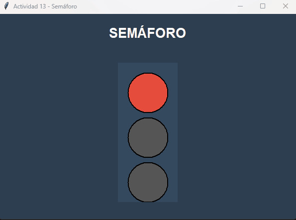

# 📚 Tkinter Practices - GUI with Python


[](#español)

This repository contains a collection of **14 educational exercises** developed with **Tkinter**, Python's standard library for creating graphical user interfaces (GUI).

---

## 🎬 Preview

### 🚦 Automatic Traffic Light - Practice 13


### 🧮 Full Calculator - Practice 14


---

## 📋 Project Contents

This project is a series of progressive exercises ranging from basic concepts to more complex Tkinter applications:

### 🔹 Basic Practices (1-5)
- **Practice 1:** Basic 1000x500 window
- **Practice 2:** Window with custom title and background color
- **Practice 3:** Label with custom styles (font, colors, padding)
- **Practice 4:** Button that prints messages to the terminal
- **Practice 5:** Button that changes a label's text

### 🔹 Data Input and Forms (6-7)
- **Practice 6:** Text field with button to display the entered name
- **Practice 7:** Interactive questionnaire with multiple input fields

### 🔹 Layout with Frames (8-9)
- **Practice 8:** 4-frame grid (2x2) with different colors
- **Practice 9:** Nested frames with an inner button

### 🔹 Advanced Interactivity (10-11)
- **Practice 10:** Move a label horizontally with buttons
- **Practice 11:** Selection list (Listbox) with display of selected item

### 🔹 Complete Applications (12-14)
- **Practice 12:** Simple addition calculator with error validation
- **Practice 13:** Traffic light simulator with automatic switching and timer
- **Practice 14:** Full basic calculator with arithmetic operations, keyboard support and validation

---

## 🎯 Learning Objectives

These practices cover the following core Tkinter concepts:

- ✅ Creating and configuring windows (`Tk()`)
- ✅ Basic widgets: `Label`, `Button`, `Entry`, `Listbox`, `Canvas`
- ✅ Geometry managers: `pack()`, `grid()`, `place()`
- ✅ Event handling with `command` and `bind()`
- ✅ Layout organization with `Frame` and nested frames
- ✅ Input data validation
- ✅ Using timers with `after()`
- ✅ Pop-up messages with `messagebox`
- ✅ Advanced customization (colors, fonts, styles)

---

## 🚀 Highlights

### Practice 13: Automatic Traffic Light
- Realistic traffic light simulation with three lights (red, yellow, green)
- Automatic switching every 5 seconds
- Visual countdown timer
- Design using `Canvas` for graphical representation

### Practice 14: Full Calculator
- Basic arithmetic operations (+, -, *, /)
- Parentheses and decimal support
- Keyboard shortcuts (Enter, Escape, Backspace)
- Expression validation with error handling
- Modern interface with color-coded buttons
- Clear and delete buttons

---

## 📦 Requirements

```bash
Python 3.x
tkinter (included in standard Python installations)
```

---

## ▶️ How to Run

1. Clone this repository:
```bash
git clone https://github.com/TheNarratorVIMMXX/tkinter-practices.git
cd tkinter-practices
```

2. Run any practice directly:
```bash
python practica_01.py
python practica_14.py  # Full calculator
```

---

## 📚 Key Concepts Learned

1. **Layout Management**: Differences between `pack()`, `grid()` and `place()`
2. **Event-Driven Programming**: Event handling with callbacks
3. **Data Validation**: Using `try-except` blocks for user input
4. **Global State**: Managing global variables to maintain state
5. **Timers and Animation**: Using `after()` for time-based operations
6. **Best Practices**: Documentation, descriptive names, logic separation

---

## 📄 License

This project is educational and available for free use for learning purposes.

---

## 🤝 Contributions

If you'd like to add more practices or improve existing ones, contributions are welcome!

---

## 📧 Contact

- **Author:** Carlos Gabriel Magallanes López
- **Email:** cgmagallanes23@gmail.com
- **Development Date:** October 15-16, 2025

---

⭐ If this repository was helpful, don't forget to give it a star on GitHub!

---

<details>
<summary> Ver en Español</summary>

# 📚 Prácticas de Tkinter - GUI con Python


Este repositorio contiene una colección de **14 prácticas educativas** desarrolladas con **Tkinter**, la biblioteca estándar de Python para crear interfaces gráficas de usuario (GUI).

---

## 🎬 Vista Previa

### 🚦 Semáforo Automático - Práctica 13


### 🧮 Calculadora Completa - Práctica 14


---

## 📋 Contenido del Proyecto

Este proyecto es una serie de ejercicios progresivos que van desde conceptos básicos hasta aplicaciones más complejas con Tkinter:

### 🔹 Prácticas Básicas (1-5)
- **Práctica 1:** Ventana básica de 1000x500
- **Práctica 2:** Ventana con título personalizado y color de fondo
- **Práctica 3:** Etiqueta con estilos personalizados (fuente, colores, relleno)
- **Práctica 4:** Botón que imprime mensajes en la terminal
- **Práctica 5:** Botón que cambia el texto de una etiqueta

### 🔹 Entrada de Datos y Formularios (6-7)
- **Práctica 6:** Campo de texto con botón para mostrar el nombre ingresado
- **Práctica 7:** Cuestionario interactivo con múltiples campos de entrada

### 🔹 Organización con Marcos (8-9)
- **Práctica 8:** Cuadrícula de 4 marcos (2x2) con diferentes colores
- **Práctica 9:** Marcos anidados con botón interno

### 🔹 Interactividad Avanzada (10-11)
- **Práctica 10:** Mover una etiqueta horizontalmente con botones
- **Práctica 11:** Lista de selección (Listbox) con visualización del elemento seleccionado

### 🔹 Aplicaciones Completas (12-14)
- **Práctica 12:** Calculadora de suma simple con validación de errores
- **Práctica 13:** Simulador de semáforo con cambios automáticos y temporizador
- **Práctica 14:** Calculadora básica completa con operaciones aritméticas, soporte de teclado y validación

---

## 🎯 Objetivos de Aprendizaje

Estas prácticas cubren los siguientes conceptos fundamentales de Tkinter:

- ✅ Creación y configuración de ventanas (`Tk()`)
- ✅ Widgets básicos: `Label`, `Button`, `Entry`, `Listbox`, `Canvas`
- ✅ Gestores de geometría: `pack()`, `grid()`, `place()`
- ✅ Manejo de eventos con `command` y `bind()`
- ✅ Organización con `Frame` y marcos anidados
- ✅ Validación de entrada de datos
- ✅ Uso de temporizadores con `after()`
- ✅ Mensajes emergentes con `messagebox`
- ✅ Personalización avanzada (colores, fuentes, estilos)

---

## 🚀 Aspectos Destacados

### Práctica 13: Semáforo Automático
- Simulación realista de semáforo con tres luces (rojo, amarillo, verde)
- Cambios automáticos cada 5 segundos
- Temporizador visual con cuenta regresiva
- Diseño usando `Canvas` para representación gráfica

### Práctica 14: Calculadora Completa
- Operaciones aritméticas básicas (+, -, *, /)
- Soporte para paréntesis y decimales
- Atajos de teclado (Enter, Escape, Retroceso)
- Validación de expresiones con manejo de errores
- Interfaz moderna con colores diferenciados para cada tipo de botón
- Botones para borrar y limpiar pantalla

---

## 📦 Requisitos

```bash
Python 3.x
tkinter (incluido en las instalaciones estándar de Python)
```

---

## ▶️ Cómo Ejecutar

1. Clona este repositorio:
```bash
git clone https://github.com/TheNarratorVIMMXX/tkinter-practices.git
cd tkinter-practices
```

2. Ejecuta cualquier práctica directamente:
```bash
python practica_01.py
python practica_14.py  # Calculadora completa
```

---

## 📚 Conceptos Clave Aprendidos

1. **Gestión de Diseño**: Diferencias entre `pack()`, `grid()` y `place()`
2. **Programación Orientada a Eventos**: Manejo de eventos con callbacks
3. **Validación de Datos**: Uso de bloques `try-except` para la entrada del usuario
4. **Estado Global**: Manejo de variables globales para mantener el estado
5. **Temporizadores y Animación**: Uso de `after()` para operaciones temporales
6. **Buenas Prácticas**: Documentación, nombres descriptivos, separación de lógica

---

## 📄 Licencia

Este proyecto es de carácter educativo y está disponible para uso libre con fines de aprendizaje.

---

## 🤝 Contribuciones

Si deseas agregar más prácticas o mejorar las existentes, ¡las contribuciones son bienvenidas!

---

## 📧 Contacto

- **Autor:** Carlos Gabriel Magallanes López
- **Correo:** cgmagallanes23@gmail.com
- **Fecha de Desarrollo:** 15-16 de octubre de 2025

---

⭐ ¡Si este repositorio te fue de utilidad, no olvides darle una estrella en GitHub!

</details>
